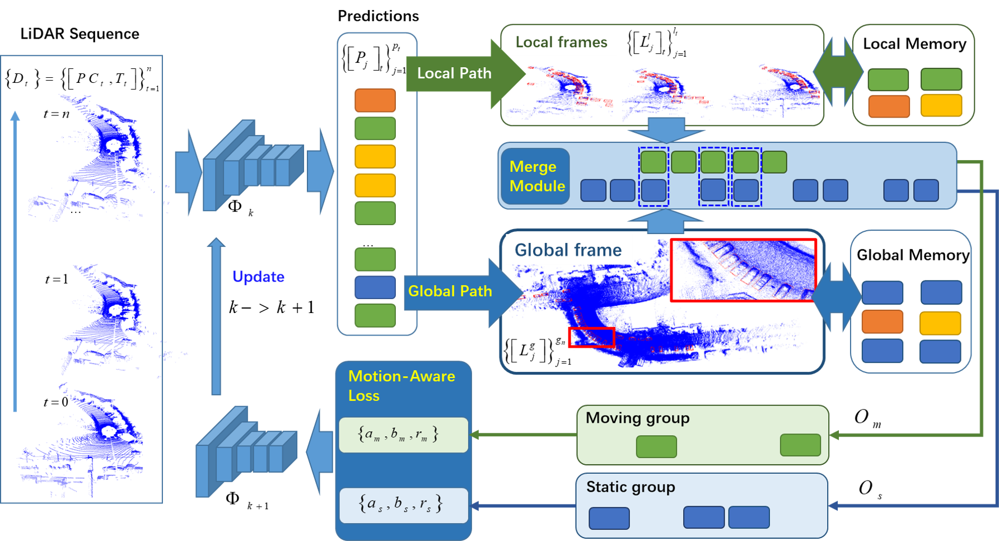

# MA-ST3D

Code release for the paper **MA-ST3D: Motion Associated Self-Training for Unsupervised Domain Adaptation on 3D Object Detection**, TIP 2024

**Authors**: Chi Zhang, Wenbo Chen,  Wei Wang, Zhaoxiang Zhang 

<!-- [[paper]](https://arxiv.org/abs/2103.05346); -->


## Introduction

Unsupervised domain adaptation (UDA) for 3D object detectors has been focused on to eliminate the prohibitive costs for a large number of 3D annotations, which is a critical requirement for model training. Self-training (ST) has emerged as a simple and effective technique for UDA. The major issue involved in ST-UDA for 3D object detection is refining the imprecise predictions caused by domain shift and generating correct pseudo labels as supervisory signals. In this study, we present a novel ST-UDA framework to generate high quality pseudo labels by associating predictions of 3D point cloud sequences during ego motion according to spatial and temporal consistency, named motion-associated self-training for 3D object detection (MA-ST3D). MA-ST3D maintains a global-local pathway (GLP) architecture to generate high-quality pseudo-labels by leveraging both intra-frame and inter-frame consistencies along the spatial dimension of the LiDAR’s ego motion. It also equips two memory modules for both global and local pathways, called global memory and local memory, to suppress the temporal fluctuation of pseudo-labels during self-training iterations. In addition, a motion-aware loss is introduced to impose discriminated regulations on pseudo labels with different motion statuses, which mitigates the harmful spread of false positive pseudo labels. Finally, our method is evaluated on three representative domain adaptation tasks on authoritative 3D benchmark datasets (i.e. Waymo, Kitti and nuScenes). MA-ST3D achieved SOTA performance on all evaluated UDA settings and even surpassed the weakly supervised DA methods on the Kitti and NuScenes object detection benchmark.



## Model Zoo

### Nuscenes -> KITTI TASK (Second-IOU)

| method | Car@R40 | Pedestrian@R40 | Cyclist@R40 | download | 
|---------------------------------------------|----------:|:-------:|:-------:|:---------:|
| ST3D | 75.94 / 54.10 |  40.47 / 34.37 |  29.58 / 21.21 |  | 
| MA-ST3D   | 79.48 / 64.63 |  40.46 / 34.31 |  24.51 / 20.14 | [model](https://drive.google.com/file/d/12f5EwWz2AugC0Ba3NETQG87GqE2C12Xz/view?usp=sharing) |


## Installation

Please refer to [INSTALL.md](docs/INSTALL.md) for the installation.

## Getting Started

Please refer to [GETTING_STARTED.md](docs/GETTING_STARTED.md) to learn more usage about this project.

### Supported features and ToDo List

- [x] Support inference and pre-trained model 

- [x] Support training code on Nuscenes -> KITTI task

- [ ] Update to Latest OpenPCDet version.
  
- [ ] Support more adaptation tasks.

## License

Our code is released under the Apache 2.0 license.

## Acknowledgement

We sincerely thank the authors of [ST3D](https://github.com/CVMI-Lab/ST3D) and [OpenPCDet](https://github.com/open-mmlab/OpenPCDet/commit/e3bec15f1052b4827d942398f20f2db1cb681c01) Development Team for open sourcing their methods.

<!-- ## Citation

If you find this project useful in your research, please consider cite:
```
@article{zhang2024ma-st3d,
    title={MA-ST3D: Motion Associated Self-Training for Unsupervised Domain Adaptation on 3D Object Detection},
    author={Zhang, chi and Chen, Wenbo and Wang, Wei and Zhang, Zhaoxiang},
    journal={IEEE Transactions on Image Processing},
    year={2024}
}
``` -->
